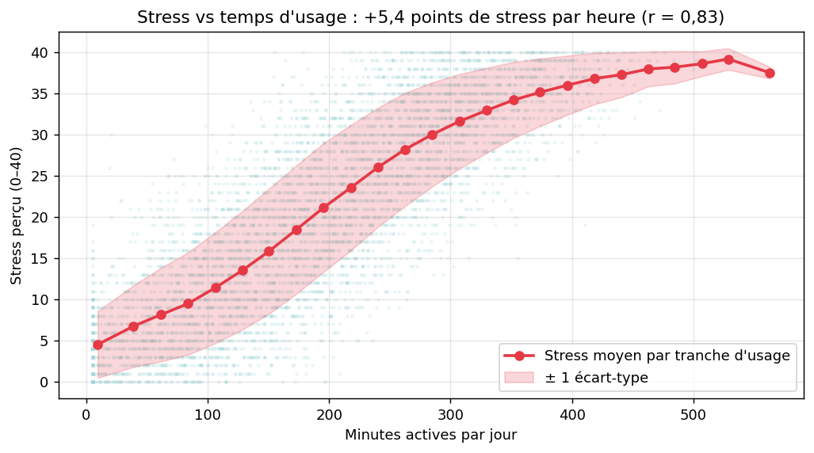
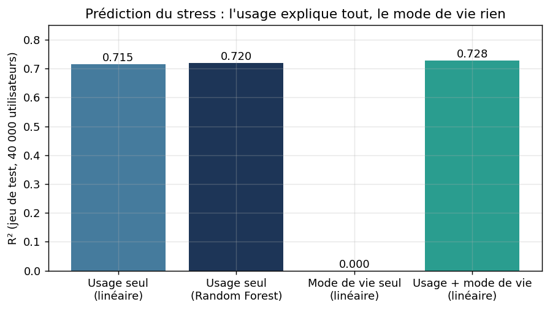
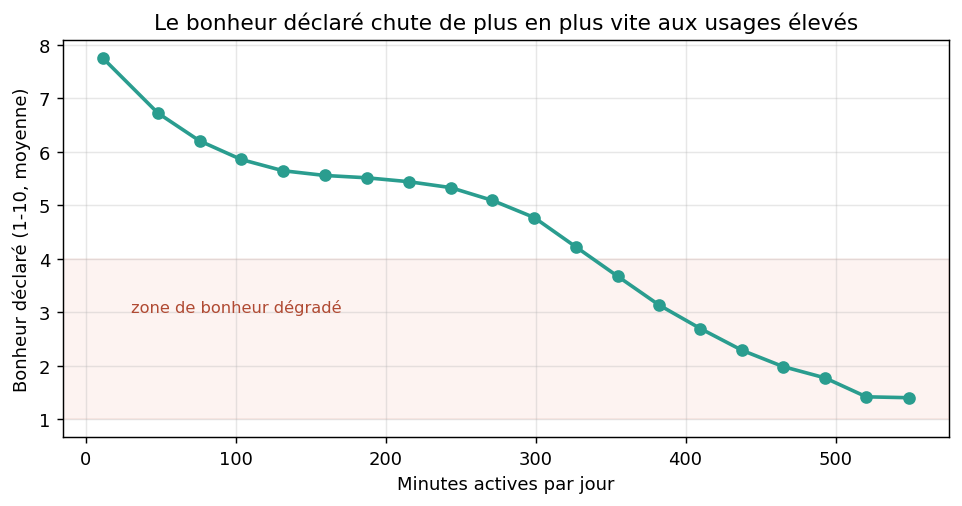
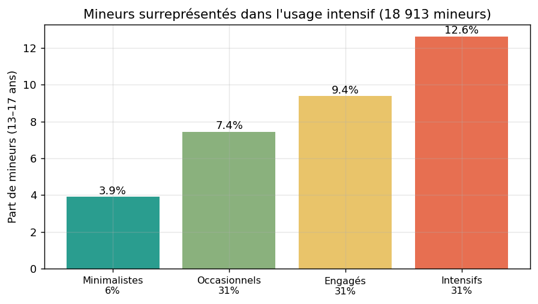
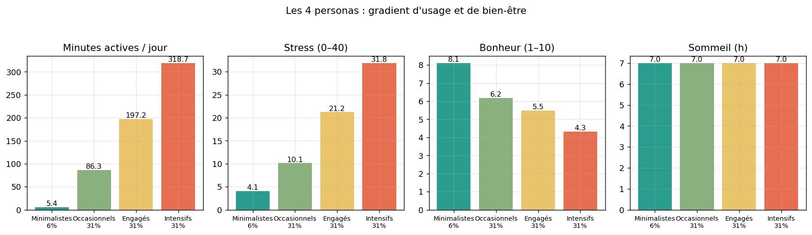
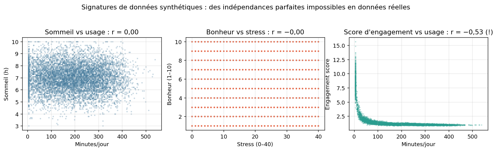

# Instagram Usage and User Well-Being
### Behavioral segmentation and predictive analysis of 200,000 users

[](https://colab.research.google.com/drive/1G8AKoqsw-zFK5mJtFfE1DkIknY26cgoz)


**Does heavy Instagram use go hand in hand with worse well-being? And can you split 200,000 users into profiles a product team can actually act on?** This project answers both, end to end: data audit, feature engineering, validated clustering, predictive modeling, and a critical audit that ends up proving the dataset itself is synthetic.

Role played: data consultant hired by Instagram's Innovation Department (Epitech Rush 4 case study, MSc program). Deliverables include a jargon-free client report, a full methodology report and a defense deck, all in `reports/`.

**Author:** Gendell Janssens · July 2026

---

## Table of contents

1. [The business question](#1-the-business-question)
2. [The data](#2-the-data)
3. [What I did](#3-what-i-did)
4. [Findings](#4-findings)
5. [The four personas](#5-the-four-personas)
6. [The twist: proving the data is synthetic](#6-the-twist-proving-the-data-is-synthetic)
7. [Recommendations delivered to the client](#7-recommendations-delivered-to-the-client)
8. [Limitations](#8-limitations)
9. [Repository structure](#9-repository-structure)
10. [Reproducing the analysis](#10-reproducing-the-analysis)

---

## 1. The business question

Instagram's Innovation Department (the fictional client) asked two things:

- **Quantify** how platform usage relates to three well-being indicators: perceived stress, sleep, and self-reported happiness.
- **Segment** users from their usage patterns into profiles that product, marketing and trust-and-safety teams can target.

Ground rule kept throughout: every measured relationship is reported as an **association**, never a causal effect. Cross-sectional data cannot tell whether usage drives stress or stressed people use more; the recommendations therefore embed A/B tests to settle causality action by action.

## 2. The data

200,000 Instagram user profiles (ages 13-65, 10 countries), 58 variables each, in three families:

| Family | Examples |
|---|---|
| Who the user is | age, gender, country, employment, lifestyle (exercise, diet, work hours) |
| How they use Instagram | active minutes/day, sessions, time per surface (Feed, Reels, Explore, Messages), likes, comments, ads viewed and clicked |
| How they feel | perceived stress (0-40), sleep hours/night, self-reported happiness (1-10) |

The CSVs are ~55 MB each and therefore **not stored in this repo**. Source: [Social Media User Analysis on Kaggle](https://www.kaggle.com/datasets/rockyt07/social-media-user-analysis). A full data dictionary (every variable family, scales, quality notes) is in [`data/README.md`](data/README.md).

The audit surfaced two things worth pausing on:

- **Two files were provided with identical schemas.** A line-by-line comparison showed all 52 behavioral and well-being columns are strictly identical; only 6 secondary profile fields diverge. One file was kept, the divergences documented as a data-quality signal.
- **The documentation was wrong about the stress scale.** It claims 0-10; the data runs 0-40. A naive range check based on the docs would have flagged 73% of rows as invalid. Rule applied: when data and documentation disagree, verify the data, then fix the documentation.

Zero missing values and zero duplicates across 200k rows. Which sounds great, until you realize no real pipeline is that clean (see [section 6](#6-the-twist-proving-the-data-is-synthetic)).

## 3. What I did

```
audit  →  feature engineering  →  clustering (validated)  →  business tiers  →  prediction  →  critical audit
```

1. **Feature engineering.** Raw counters measure volume; 10 engineered ratio features capture *style*: session depth, scroll speed, content mix, interaction rate, checking frequency. One trap documented and dodged: ratios explode when denominators approach zero, which can make a near-dormant user look "hyperactive" (5 min/day in 1 session mechanically shows 11 sessions per active hour).
2. **K-Means clustering, k validated four ways.** Elbow, silhouette, Calinski-Harabasz and Davies-Bouldin all converge on **k = 2** (silhouette 0.551 at k=2, collapsing to 0.18 at k=3). Well-being variables were excluded from clustering to avoid circular logic, then overlaid afterwards as an external check.
3. **Business tiers.** A 94/6 split is statistically right but commercially useless. The active cluster was cut at usage tertiles into three intensity levels, explicitly framed as a management convention (like income brackets), not a fake statistical discovery.
4. **Prediction.** Linear regression baseline vs Random Forest on an 80/20 train/test split, plus a formal confounder test comparing usage-only, lifestyle-only and combined feature sets.

## 4. Findings

### Usage time drives reported stress, linearly



**+5.4 stress points (on a 0-40 scale) per extra daily hour** of usage, r = 0.83, with no safe plateau anywhere in the range. Between a 1h/day and a 5h/day user: 27 points of average difference, more than half the scale.

### It's the dose, not the style



The Random Forest cannot beat the plain linear model (R² 0.720 vs 0.715): the relationship is genuinely linear. Feature importance puts **89% of the signal on usage volume alone**; content mix (Reels vs Feed vs Messages) is second-order. And lifestyle variables explain exactly **0.000** of stress variance, so no confounding structure exists in this data.

### Happiness doesn't decline linearly, it collapses



Moderate usage costs little declared happiness. Past 4-5 hours a day, the curve dives, down to 1.6/10 at the extreme. Interventions should concentrate on heavy users, not spread evenly.

### Sleep: a null result, reported as such

Sleep sits at 7.0 hours in every group, r = 0.00 with usage. Nothing in this data links Instagram to sleep, and saying so plainly beats forcing a story.

### Minors skew toward intensive usage



18,913 users are aged 13-17. Their share rises monotonically with usage intensity: 3.9% of Minimal users vs **12.6% of Intensive users**. Under the EU Digital Services Act, "1 in 8 intensive users is a minor" is exactly the kind of number a regulator asks about.

## 5. The four personas



| Persona | Share | Usage/day | Stress (0-40) | Happiness (1-10) | Reading |
|---|---|---|---|---|---|
| **The Peaceful Minimalist** | 6% | 5 min | 4.1 | 8.1 | Near-dormant, oldest group, best well-being. Don't "re-engage" aggressively. |
| **The Casual Browser** | 31% | 1h26 | 10.1 | 6.2 | The healthy reference profile. Protect it from escalation mechanics. |
| **The Engaged Regular** | 31% | 3h17 | 21.2 | 5.5 | The tipping-point group; best effort-to-impact ratio for well-being nudges. |
| **The Intensive User** | 31% | 5h19 | 31.8 | 4.3 | Youngest group, most minors, clicks the most ads. The revenue engine is the most at-risk population. |

The gradient is strictly monotonic on stress and happiness, and flat on sleep. Since well-being never entered the clustering, this ordering is a genuine external validation of the segmentation.

## 6. The twist: proving the data is synthetic



Saying "the data is artificial" is a disclaimer. Proving it is analysis. The generator's fingerprints:

| Check | Measured | Expected in real data |
|---|---|---|
| stress ~ happiness | r = -0.002 | around -0.5 (independence here is psychologically impossible) |
| minutes ~ sleep | r = 0.000 | weak but nonzero |
| stress ~ exercise, work hours | ~0.001 | moderate signals |
| minutes ~ stress | r = 0.834 | 0.1 to 0.2 in the published literature |
| provided engagement score ~ minutes | r = -0.529 | positive (the built-in score contradicts actual usage; excluded from modeling) |
| missing values / duplicates | 0 / 0 in 200k rows | never |

Reverse-engineered recipe: stress = f(minutes) + noise; happiness = g(minutes) + noise, generated independently of stress; sleep = pure noise around 7h; lifestyle = decorative noise. Consequence: effect sizes describe the generator, not humanity. What transfers to real data is the methodology, the segmentation framework and the measurement plan.

## 7. Recommendations delivered to the client

| # | Action | Target | Validation |
|---|---|---|---|
| 1 | Session-length nudges + evening wind-down mode | Engaged Regulars | A/B test |
| 2 | Personal usage dashboard with weekly digest | Intensive Users | A/B test |
| 3 | Stronger time-management defaults for minors | Minors, esp. Intensive | Cohort tracking |
| 4 | No aggressive re-engagement of the healthy profile | Casual Browsers | Quarterly tier-migration monitoring |
| 5 | Quarterly re-scoring of the segmentation, well-being tracked per tier | All | Drift monitoring |

The trade-off is stated, not hidden: Intensive users click 6.6x more ads than Minimalists, so well-being interventions cost ad impressions short-term. The DSA exposure, reputational risk and long-term value of healthier users argue for acting anyway.

## 8. Limitations

Cross-sectional data (no causal identification, reverse causality equally plausible). Self-reported outcomes. Synthetic generator with planted relationships. Tier boundaries are conventions, not natural kinds. No usage-timing data (day vs night), which is the missing variable that would make a real sleep analysis possible. Every rejected approach (direct k=4, DBSCAN, clustering on well-being, sleep prediction, country and subscription effects) is documented with its reason in the notebook and technical report.

## 9. Repository structure

```
├── notebooks/
│   └── Instagram_Wellbeing_Segmentation_v2.ipynb        # full analysis, runs top to bottom
├── reports/
│   ├── Rapport_Client_Instagram_BienEtre_PDF.pdf         # client report (French, jargon-free)
│   ├── Rapport_Technique_Instagram_BienEtre_PDF.pdf      # methodology report (French)
│   └── Presentation_Client_Instagram_BienEtre_PDFPPT.pdf # 10-slide defense deck
├── figures/                                              # all charts (PNG)
├── data/
│   └── README.md                                         # data dictionary + download instructions
└── requirements.txt
```

## 10. Reproducing the analysis

1. Download the dataset from Kaggle: [Social Media User Analysis](https://www.kaggle.com/datasets/rockyt07/social-media-user-analysis) (`instagram_usage_lifestyleSafe.csv` and `instagram_users_lifestyleSafe.csv`, ~55 MB each, excluded from the repo).
2. Put both CSVs next to the notebook or in the `data/` folder. In Colab, the notebook mounts Google Drive by itself.
3. `pip install -r requirements.txt`
4. Run the notebook top to bottom (~5 minutes). Seeds are fixed (`random_state=42`): two runs give identical numbers.

Or skip the setup entirely and [open it in Colab](https://colab.research.google.com/drive/1G8AKoqsw-zFK5mJtFfE1DkIknY26cgoz).

**Stack:** Python, pandas, scikit-learn, matplotlib, seaborn · **Methods:** K-Means, silhouette / Calinski-Harabasz / Davies-Bouldin validation, PCA, linear regression, Random Forest, confounder analysis
